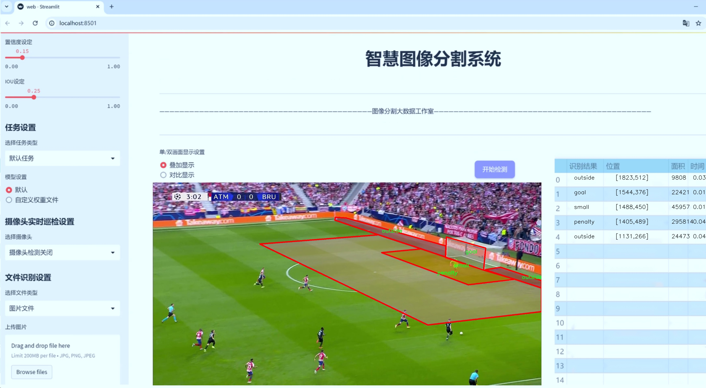
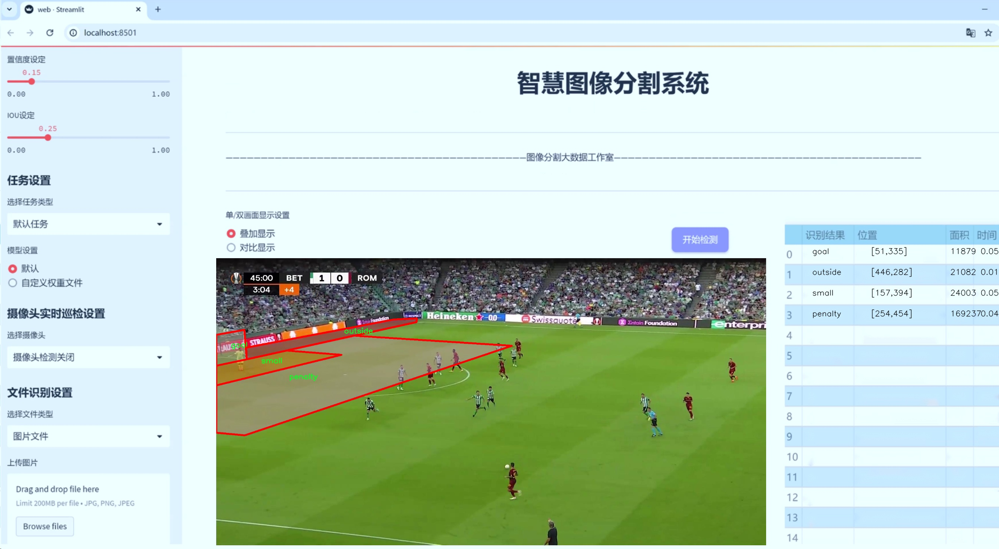
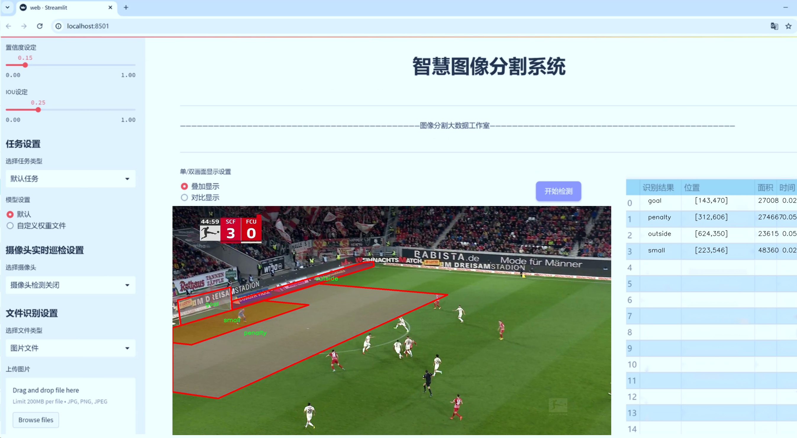
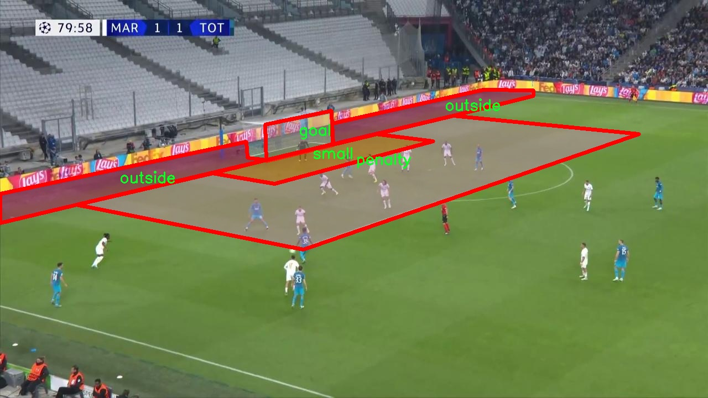
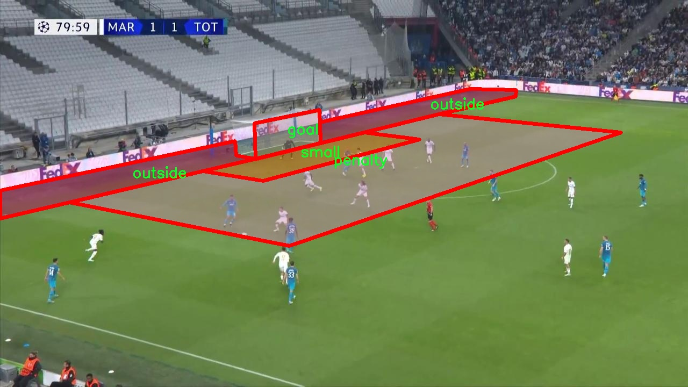
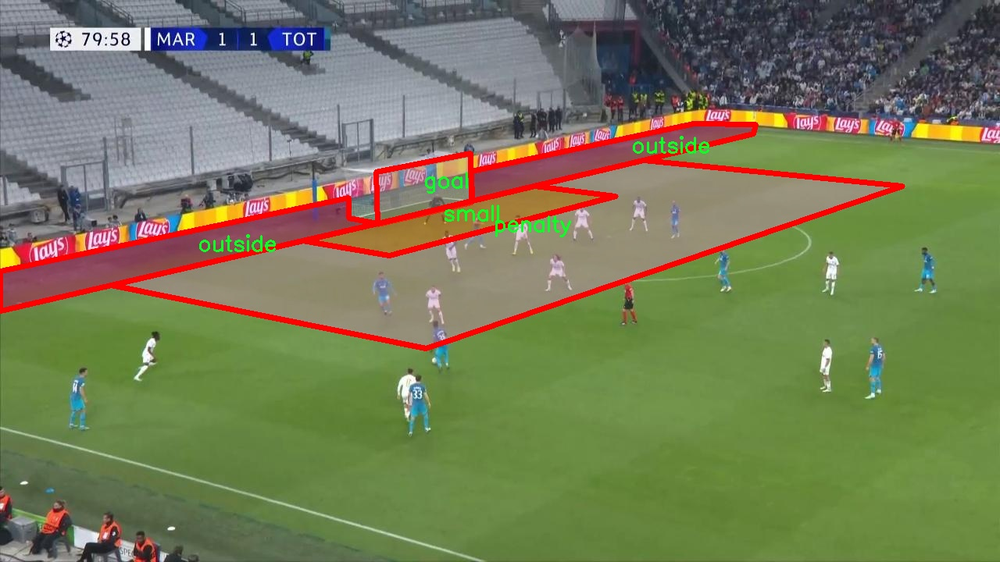

# 足球场区域分割系统源码＆数据集分享
 [yolov8-seg-C2f-ContextGuided＆yolov8-seg-AIFI等50+全套改进创新点发刊_一键训练教程_Web前端展示]

### 1.研究背景与意义

项目参考[ILSVRC ImageNet Large Scale Visual Recognition Challenge](https://gitee.com/YOLOv8_YOLOv11_Segmentation_Studio/projects)

项目来源[AAAI Global Al lnnovation Contest](https://kdocs.cn/l/cszuIiCKVNis)

研究背景与意义

随着计算机视觉技术的迅猛发展，目标检测与分割在体育赛事分析、场景理解和智能监控等领域的应用日益广泛。足球作为全球最受欢迎的运动之一，其比赛过程中的动态场景复杂多变，涉及多个关键区域的实时分析与理解。因此，开发一种高效的足球场区域分割系统，能够为教练、运动员和分析师提供重要的战术支持和数据驱动的决策依据，具有重要的理论价值和实际意义。

本研究基于改进的YOLOv8模型，旨在实现对足球场不同区域的精准分割。YOLO（You Only Look Once）系列模型以其快速的检测速度和良好的精度在目标检测领域取得了显著成就。YOLOv8作为最新版本，进一步优化了网络结构和训练策略，具备了更强的特征提取能力和更高的分割精度。然而，传统的YOLO模型在处理复杂场景时，尤其是在多类别目标的分割任务中，仍然面临一定的挑战。因此，通过对YOLOv8进行改进，结合实例分割技术，能够有效提升足球场区域的分割效果，进而为比赛分析提供更为细致的区域信息。

在本研究中，我们使用的“Field_seg_total_dataset”数据集包含3000张标注图像，涵盖了四个主要类别：球门、场外、罚球区和小禁区。这些类别的划分不仅反映了足球场的基本结构，也为后续的战术分析提供了重要的基础数据。通过对这些区域的精确分割，系统能够实时识别球员在场上的位置、战术布阵及其与球的相对位置，从而为教练提供实时战术调整的依据。此外，基于区域分割的分析还可以帮助运动员更好地理解比赛局势，提高其在场上的决策能力。

研究的意义不仅体现在技术层面，更在于其对足球运动的深远影响。通过对足球场区域的精准分割，教练团队可以更好地制定战术策略，提升球队的整体表现。同时，运动员在训练和比赛中能够借助这些数据分析，优化个人技术和战术执行。此外，该系统的开发也为其他运动项目的区域分割和分析提供了借鉴，推动了体育数据分析技术的进步。

综上所述，基于改进YOLOv8的足球场区域分割系统的研究，不仅为计算机视觉领域的实例分割技术提供了新的思路，也为足球运动的战术分析与决策支持提供了实用工具，具有重要的学术价值和应用前景。通过本研究，我们希望能够推动足球赛事分析的智能化进程，为体育科学的发展贡献一份力量。

### 2.图片演示







##### 注意：由于此博客编辑较早，上面“2.图片演示”和“3.视频演示”展示的系统图片或者视频可能为老版本，新版本在老版本的基础上升级如下：（实际效果以升级的新版本为准）

  （1）适配了YOLOV8的“目标检测”模型和“实例分割”模型，通过加载相应的权重（.pt）文件即可自适应加载模型。

  （2）支持“图片识别”、“视频识别”、“摄像头实时识别”三种识别模式。

  （3）支持“图片识别”、“视频识别”、“摄像头实时识别”三种识别结果保存导出，解决手动导出（容易卡顿出现爆内存）存在的问题，识别完自动保存结果并导出到tempDir中。

  （4）支持Web前端系统中的标题、背景图等自定义修改，后面提供修改教程。

  另外本项目提供训练的数据集和训练教程,暂不提供权重文件（best.pt）,需要您按照教程进行训练后实现图片演示和Web前端界面演示的效果。

### 3.视频演示

[3.1 视频演示](https://www.bilibili.com/video/BV1nryRYzE5W/)

### 4.数据集信息展示

##### 4.1 本项目数据集详细数据（类别数＆类别名）

nc: 4
names: ['goal', 'outside', 'penalty', 'small']


##### 4.2 本项目数据集信息介绍

数据集信息展示

在本研究中，我们采用了名为“Field_seg_total_dataset”的数据集，以支持对YOLOv8-seg模型的训练，旨在提升足球场区域分割系统的性能。该数据集专门为足球场的不同区域进行标注，涵盖了四个主要类别，分别是“goal”（球门）、“outside”（场外区域）、“penalty”（罚球区）和“small”（小禁区）。这些类别的选择不仅反映了足球场的基本结构，也为模型提供了丰富的上下文信息，使其能够在复杂的场景中进行准确的区域分割。

数据集的构建过程经过精心设计，确保了标注的准确性和多样性。每个类别的样本均来源于不同的足球场景，包括职业比赛、业余联赛以及训练场地等，旨在增强模型的泛化能力。数据集中包含的图像覆盖了不同的天气条件、时间段和视角，这些因素都可能影响足球场的视觉特征。通过这种多样化的样本选择，模型能够更好地适应实际应用中的各种情况。

在数据集的标注过程中，采用了高精度的图像分割技术，以确保每个类别的边界清晰可辨。球门的标注不仅考虑了其形状和位置，还包括了与球场其他区域的相对关系；场外区域的标注则需要准确界定球场的边界；罚球区和小禁区的标注则强调了这些区域在比赛中的重要性和功能。通过这种细致的标注方式，数据集为YOLOv8-seg模型提供了高质量的训练数据，使其能够学习到不同区域的特征和相互关系。

此外，数据集的规模也经过精心规划，以确保训练过程的有效性和效率。包含的图像数量经过严格筛选，确保每个类别都有足够的样本量，以支持深度学习模型的训练。通过这种方式，模型不仅能够学习到各个类别的特征，还能够掌握不同类别之间的关系，从而在实际应用中实现更高的分割精度。

在模型训练过程中，我们将使用“Field_seg_total_dataset”进行多轮迭代训练，并结合数据增强技术，以进一步提升模型的鲁棒性。数据增强不仅能够扩展训练样本的多样性，还能有效防止模型的过拟合现象，从而提高其在未知数据上的表现。

总之，“Field_seg_total_dataset”作为本研究的核心数据集，提供了丰富的标注信息和多样化的样本，为改进YOLOv8-seg的足球场区域分割系统奠定了坚实的基础。通过对该数据集的深入分析和应用，我们期望能够实现更高效、更准确的足球场区域分割，为未来的足球比赛分析和相关应用提供强有力的支持。








### 5.全套项目环境部署视频教程（零基础手把手教学）

[5.1 环境部署教程链接（零基础手把手教学）](https://www.bilibili.com/video/BV1jG4Ve4E9t/?vd_source=bc9aec86d164b67a7004b996143742dc)


[5.2 安装Python虚拟环境创建和依赖库安装视频教程链接（零基础手把手教学）](https://www.bilibili.com/video/BV1nA4VeYEze/?vd_source=bc9aec86d164b67a7004b996143742dc)

### 6.手把手YOLOV8-seg训练视频教程（零基础小白有手就能学会）

[6.1 手把手YOLOV8-seg训练视频教程（零基础小白有手就能学会）](https://www.bilibili.com/video/BV1cA4VeYETe/?vd_source=bc9aec86d164b67a7004b996143742dc)


按照上面的训练视频教程链接加载项目提供的数据集，运行train.py即可开始训练



     Epoch   gpu_mem       box       obj       cls    labels  img_size
     1/200     0G   0.01576   0.01955  0.007536        22      1280: 100%|██████████| 849/849 [14:42<00:00,  1.04s/it]
               Class     Images     Labels          P          R     mAP@.5 mAP@.5:.95: 100%|██████████| 213/213 [01:14<00:00,  2.87it/s]
                 all       3395      17314      0.994      0.957      0.0957      0.0843

     Epoch   gpu_mem       box       obj       cls    labels  img_size
     2/200     0G   0.01578   0.01923  0.007006        22      1280: 100%|██████████| 849/849 [14:44<00:00,  1.04s/it]
               Class     Images     Labels          P          R     mAP@.5 mAP@.5:.95: 100%|██████████| 213/213 [01:12<00:00,  2.95it/s]
                 all       3395      17314      0.996      0.956      0.0957      0.0845

     Epoch   gpu_mem       box       obj       cls    labels  img_size
     3/200     0G   0.01561    0.0191  0.006895        27      1280: 100%|██████████| 849/849 [10:56<00:00,  1.29it/s]
               Class     Images     Labels          P          R     mAP@.5 mAP@.5:.95: 100%|███████   | 187/213 [00:52<00:00,  4.04it/s]
                 all       3395      17314      0.996      0.957      0.0957      0.0845


### 7.50+种全套YOLOV8-seg创新点代码加载调参视频教程（一键加载写好的改进模型的配置文件）

[7.1 50+种全套YOLOV8-seg创新点代码加载调参视频教程（一键加载写好的改进模型的配置文件）](https://www.bilibili.com/video/BV1Hw4VePEXv/?vd_source=bc9aec86d164b67a7004b996143742dc)

### 8.YOLOV8-seg图像分割算法原理

原始YOLOv8-seg算法原理

YOLOv8-seg算法是YOLO系列中的最新版本，结合了目标检测与图像分割的功能，标志着目标检测领域的又一次重要进步。YOLO（You Only Look Once）作为一种经典的一阶段目标检测算法，最初将目标检测任务转化为回归问题，通过一个单一的神经网络模型同时预测目标的位置和类别。随着YOLO系列的不断演进，算法在检测精度、速度和模型轻量化方面都取得了显著的提升，尤其是YOLOv8的推出，进一步优化了这些特性，使其能够在实时检测和嵌入式设备上表现出色。

YOLOv8-seg的核心原理在于其网络结构的设计，主要由主干网络（Backbone）、特征增强网络（Neck）和检测头（Head）三部分组成。主干网络采用了CSP（Cross Stage Partial）思想，通过引入残差连接和瓶颈结构来提高特征提取的效率和准确性。与之前的YOLO版本相比，YOLOv8在主干网络中引入了C2f模块，取代了传统的C3模块，这一新模块通过增加更多的残差连接，使得网络在保持轻量化的同时，能够获得更丰富的梯度信息，从而提高了特征提取的能力。

在特征增强网络部分，YOLOv8-seg采用了PAN-FPN（Path Aggregation Network - Feature Pyramid Network）的结构，这种结构通过多尺度特征融合技术，将来自主干网络不同阶段的特征图进行有效融合，以便更好地捕捉不同尺度目标的信息。这种特征融合不仅提升了目标检测的性能，还增强了模型对复杂场景的鲁棒性，使得YOLOv8-seg能够在多种应用场景中表现出色。

YOLOv8-seg的检测头部分是其最具创新性的地方。与以往的耦合头不同，YOLOv8-seg采用了解耦合头结构，将分类和回归任务分离开来。这种设计使得每个任务可以更加专注于自身的目标，从而有效解决了复杂场景下的定位不准和分类错误的问题。此外，YOLOv8-seg还引入了Anchor-free目标检测方法，直接通过回归方式预测目标的位置和大小，省去了传统方法中预定义锚点框的繁琐过程。这一创新使得模型在处理不同尺度和形状的目标时，能够更加灵活和高效。

在训练过程中，YOLOv8-seg采用了一系列数据增强策略，以提高模型的泛化能力。通过动态Task-Aligned Assigner样本分配策略，模型能够在训练的最后10个epoch中关闭马赛克增强，从而更好地适应实际应用场景。此外，YOLOv8-seg在损失计算方面也进行了优化，使用BCELoss作为分类损失，DFLLoss和CIoULoss作为回归损失，这一组合使得模型在训练过程中能够更有效地学习到目标的特征。

YOLOv8-seg的另一个重要特点是其模型的多样性。根据不同场景的需求，YOLOv8提供了n、s、m、l、x共五种不同尺度的模型。这些模型在输入端、主干网络和检测端的结构上有所不同，以适应不同的计算资源和应用需求。尤其是YOLOv8n模型，其在网络结构上进行了极大的简化，适合在资源受限的环境中使用，而YOLOv8x模型则在性能上进行了最大化提升，适合对精度要求极高的应用场景。

综上所述，YOLOv8-seg算法通过引入先进的网络结构和创新的训练策略，不仅在目标检测领域取得了显著的进展，同时也为图像分割任务提供了强有力的支持。其高效的特征提取能力、灵活的目标定位方法以及多样化的模型选择，使得YOLOv8-seg在实际应用中展现出广泛的适用性和强大的性能。随着计算机视觉技术的不断发展，YOLOv8-seg无疑将在更多的领域中发挥重要作用，推动智能视觉系统的进一步发展。


### 9.系统功能展示（检测对象为举例，实际内容以本项目数据集为准）

图9.1.系统支持检测结果表格显示

  图9.2.系统支持置信度和IOU阈值手动调节

  图9.3.系统支持自定义加载权重文件best.pt(需要你通过步骤5中训练获得)

  图9.4.系统支持摄像头实时识别

  图9.5.系统支持图片识别

  图9.6.系统支持视频识别

  图9.7.系统支持识别结果文件自动保存

  图9.8.系统支持Excel导出检测结果数据


### 10.50+种全套YOLOV8-seg创新点原理讲解（非科班也可以轻松写刊发刊，V11版本正在科研待更新）

#### 10.1 由于篇幅限制，每个创新点的具体原理讲解就不一一展开，具体见下列网址中的创新点对应子项目的技术原理博客网址【Blog】：


[10.1 50+种全套YOLOV8-seg创新点原理讲解链接](https://gitee.com/qunmasj/good)

#### 10.2 部分改进模块原理讲解(完整的改进原理见上图和技术博客链接)【如果此小节的图加载失败可以通过CSDN或者Github搜索该博客的标题访问原始博客，原始博客图片显示正常】
### YOLOv8简介

YOLOv8 是 Ultralytics 公司继 YOLOv5 算法之后开发的下一代算法模型，目前支持图像分类、物体检测和实例分割任务。YOLOv8 是一个 SOTA 模型，它建立在之前YOLO 系列模型的成功基础上，并引入了新的功能和改进，以进一步提升性能和灵活性。具体创新包括：一个新的骨干网络、一个新的 Ancher-Free 检测头和一个新的损失函数，可以在从 CPU 到 GPU 的各种硬件平台上运行。注意到ultralytics 并没有直接将开源库命名为 YOLOv8，而是直接使用 Ultralytics这个单词，原因是Ultralytics这个库的定位是算法框架，而非特指某一个特定算法，其希望这个库不仅仅能够用于 YOLO 系列模型，同时也能支持其他的视觉任务如图像分类、实例分割等。下图画图YOLOv8目标检测算法同其他YOLO系列算法（YOLOv5、6、7）的实验对比图，左边是模型参数量对比，右边是速度对比。


下面两个表分别是YOLOv8和YOLOv5（v7.0版本）官方在 COCO Val 2017 数据集上测试结果，从中看出 YOLOv8 相比 YOLOv5 精度提升大，但是 N/S/M 模型相应的参数量、FLOPS等提高了不少。


#### YOLOv8概述
提供了一个全新的SOTA模型，和YOLOv5一样，基于缩放系数也提供了 N/S/M/L/X 尺度的不同大小模型，用于满足不同场景需求，同时支持图像分类、目标检测、实例分割和姿态检测任务
在骨干网络和Neck部分将YOLOv5的C3结构换成了梯度流更丰富的 C2f 结构，并对不同尺度模型调整了不同的通道数，大幅提升了模型性能；需要注意的是C2f 模块中存在Split等操作对特定硬件部署没有之前那么友好


Head部分换成了目前主流的解耦头结构，将分类和检测头分离，同时也从 Anchor-Based换成了Anchor-Free Loss
计算方面采用了 TaskAlignedAssigner 正样本分配策略，并引入了 Distribution Focal Loss
下图画出YOLOv8目标检测算法的整体结构图


#### YOLOv8模型
YOLOv8目标检测算法的模型配置文件如下：


从配置文件可以看出，YOLOv8与YOLOv5模型最明显的差异是使用C2F模块替换了原来的C3模块，两个模块的结构图下图所示。


另外Head 部分变化最大，从原先的耦合头变成了解耦头，并且从 YOLOv5 的 Anchor-Based 变成了 Anchor-Free。其结构对比图如下所示：

### RepViT简介

近年来，与轻量级卷积神经网络(cnn)相比，轻量级视觉变压器(ViTs)在资源受限的移动设备上表现出了更高的性能和更低的延迟。这种改进通常归功于多头自注意模块，它使模型能够学习全局表示。然而，轻量级vit和轻量级cnn之间的架构差异还没有得到充分的研究。在这项研究中，我们重新审视了轻量级cnn的高效设计，并强调了它们在移动设备上的潜力。通过集成轻量级vit的高效架构选择，我们逐步增强了标准轻量级CNN的移动友好性，特别是MobileNetV3。这就产生了一个新的纯轻量级cnn家族，即RepViT。大量的实验表明，RepViT优于现有的轻型vit，并在各种视觉任务中表现出良好的延迟。在ImageNet上，RepViT在iPhone 12上以近1ms的延迟实现了超过80%的top-1精度，据我们所知，这是轻量级模型的第一次。

#### RepViT简介
轻量级模型研究一直是计算机视觉任务中的一个焦点，其目标是在降低计算成本的同时达到优秀的性能。轻量级模型与资源受限的移动设备尤其相关，使得视觉模型的边缘部署成为可能。在过去十年中，研究人员主要关注轻量级卷积神经网络（CNNs）的设计，提出了许多高效的设计原则，包括可分离卷积 、逆瓶颈结构 、通道打乱 和结构重参数化等，产生了 MobileNets ，ShuffleNets和 RepVGG 等代表性模型。

另一方面，视觉 Transformers（ViTs）成为学习视觉表征的另一种高效方案。与 CNNs 相比，ViTs 在各种计算机视觉任务中表现出了更优越的性能。然而，ViT 模型一般尺寸很大，延迟很高，不适合资源受限的移动设备。因此，研究人员开始探索 ViT 的轻量级设计。许多高效的ViTs设计原则被提出，大大提高了移动设备上 ViTs 的计算效率，产生了EfficientFormers ，MobileViTs等代表性模型。这些轻量级 ViTs 在移动设备上展现出了相比 CNNs 的更强的性能和更低的延迟。

轻量级 ViTs 优于轻量级 CNNs 的原因通常归结于多头注意力模块，该模块使模型能够学习全局表征。然而，轻量级 ViTs 和轻量级 CNNs 在块结构、宏观和微观架构设计方面存在值得注意的差异，但这些差异尚未得到充分研究。这自然引出了一个问题：轻量级 ViTs 的架构选择能否提高轻量级 CNN 的性能？在这项工作中，我们结合轻量级 ViTs 的架构选择，重新审视了轻量级 CNNs 的设计。我们的旨在缩小轻量级 CNNs 与轻量级 ViTs 之间的差距，并强调前者与后者相比在移动设备上的应用潜力。


在 ConvNeXt 中，参考该博客提出的基于 ResNet50 架构的基础上通过严谨的理论和实验分析，最终设计出一个非常优异的足以媲美 Swin-Transformer 的纯卷积神经网络架构。同样地，RepViT也是主要通过将轻量级 ViTs 的架构设计逐步整合到标准轻量级 CNN，即MobileNetV3-L，来对其进行针对性地改造（魔改）。在这个过程中，作者们考虑了不同粒度级别的设计元素，并通过一系列步骤达到优化的目标。


详细优化步骤如下：

#### 训练配方的对齐
论文中引入了一种衡量移动设备上延迟的指标，并将训练策略与现有的轻量级 ViTs 对齐。这一步骤主要是为了确保模型训练的一致性，其涉及两个概念，即延迟度量和训练策略的调整。

#### 延迟度量指标
为了更准确地衡量模型在真实移动设备上的性能，作者选择了直接测量模型在设备上的实际延迟，以此作为基准度量。这个度量方法不同于之前的研究，它们主要通过FLOPs或模型大小等指标优化模型的推理速度，这些指标并不总能很好地反映在移动应用中的实际延迟。

#### 训练策略的对齐
这里，将 MobileNetV3-L 的训练策略调整以与其他轻量级 ViTs 模型对齐。这包括使用 AdamW 优化器-ViTs 模型必备的优化器，进行 5 个 epoch 的预热训练，以及使用余弦退火学习率调度进行 300 个 epoch 的训练。尽管这种调整导致了模型准确率的略微下降，但可以保证公平性。

#### 块设计的优化
基于一致的训练设置，作者们探索了最优的块设计。块设计是 CNN 架构中的一个重要组成部分，优化块设计有助于提高网络的性能。

#### 分离 Token 混合器和通道混合器
这块主要是对 MobileNetV3-L 的块结构进行了改进，分离了令牌混合器和通道混合器。原来的 MobileNetV3 块结构包含一个 1x1 扩张卷积，然后是一个深度卷积和一个 1x1 的投影层，然后通过残差连接连接输入和输出。在此基础上，RepViT 将深度卷积提前，使得通道混合器和令牌混合器能够被分开。为了提高性能，还引入了结构重参数化来在训练时为深度滤波器引入多分支拓扑。最终，作者们成功地在 MobileNetV3 块中分离了令牌混合器和通道混合器，并将这种块命名为 RepViT 块。

#### 降低扩张比例并增加宽度
在通道混合器中，原本的扩张比例是 4，这意味着 MLP 块的隐藏维度是输入维度的四倍，消耗了大量的计算资源，对推理时间有很大的影响。为了缓解这个问题，我们可以将扩张比例降低到 2，从而减少了参数冗余和延迟，使得 MobileNetV3-L 的延迟降低到 0.65ms。随后，通过增加网络的宽度，即增加各阶段的通道数量，Top-1 准确率提高到 73.5%，而延迟只增加到 0.89ms！

#### 宏观架构元素的优化
在这一步，本文进一步优化了MobileNetV3-L在移动设备上的性能，主要是从宏观架构元素出发，包括 stem，降采样层，分类器以及整体阶段比例。通过优化这些宏观架构元素，模型的性能可以得到显著提高。

#### 浅层网络使用卷积提取器
ViTs 通常使用一个将输入图像分割成非重叠补丁的 “patchify” 操作作为 stem。然而，这种方法在训练优化性和对训练配方的敏感性上存在问题。因此，作者们采用了早期卷积来代替，这种方法已经被许多轻量级 ViTs 所采纳。对比之下，MobileNetV3-L 使用了一个更复杂的 stem 进行 4x 下采样。这样一来，虽然滤波器的初始数量增加到24，但总的延迟降低到0.86ms，同时 top-1 准确率提高到 73.9%。

#### 更深的下采样层
在 ViTs 中，空间下采样通常通过一个单独的补丁合并层来实现。因此这里我们可以采用一个单独和更深的下采样层，以增加网络深度并减少由于分辨率降低带来的信息损失。具体地，作者们首先使用一个 1x1 卷积来调整通道维度，然后将两个 1x1 卷积的输入和输出通过残差连接，形成一个前馈网络。此外，他们还在前面增加了一个 RepViT 块以进一步加深下采样层，这一步提高了 top-1 准确率到 75.4%，同时延迟为 0.96ms。

#### 更简单的分类器
在轻量级 ViTs 中，分类器通常由一个全局平均池化层后跟一个线性层组成。相比之下，MobileNetV3-L 使用了一个更复杂的分类器。因为现在最后的阶段有更多的通道，所以作者们将它替换为一个简单的分类器，即一个全局平均池化层和一个线性层，这一步将延迟降低到 0.77ms，同时 top-1 准确率为 74.8%。

#### 整体阶段比例
阶段比例代表了不同阶段中块数量的比例，从而表示了计算在各阶段中的分布。论文选择了一个更优的阶段比例 1:1:7:1，然后增加网络深度到 2:2:14:2，从而实现了一个更深的布局。这一步将 top-1 准确率提高到 76.9%，同时延迟为 1.02 ms。

#### 卷积核大小的选择
众所周知，CNNs 的性能和延迟通常受到卷积核大小的影响。例如，为了建模像 MHSA 这样的远距离上下文依赖，ConvNeXt 使用了大卷积核，从而实现了显著的性能提升。然而，大卷积核对于移动设备并不友好，因为它的计算复杂性和内存访问成本。MobileNetV3-L 主要使用 3x3 的卷积，有一部分块中使用 5x5 的卷积。作者们将它们替换为3x3的卷积，这导致延迟降低到 1.00ms，同时保持了76.9%的top-1准确率。

#### SE 层的位置
自注意力模块相对于卷积的一个优点是根据输入调整权重的能力，这被称为数据驱动属性。作为一个通道注意力模块，SE层可以弥补卷积在缺乏数据驱动属性上的限制，从而带来更好的性能。MobileNetV3-L 在某些块中加入了SE层，主要集中在后两个阶段。然而，与分辨率较高的阶段相比，分辨率较低的阶段从SE提供的全局平均池化操作中获得的准确率提升较小。作者们设计了一种策略，在所有阶段以交叉块的方式使用SE层，从而在最小的延迟增量下最大化准确率的提升，这一步将top-1准确率提升到77.4%，同时延迟降低到0.87ms。

注意！【这一点其实百度在很早前就已经做过实验比对得到过这个结论了，SE 层放置在靠近深层的地方效果好】

#### 微观设计的调整
RepViT 通过逐层微观设计来调整轻量级 CNN，这包括选择合适的卷积核大小和优化挤压-激励（Squeeze-and-excitation，简称SE）层的位置。这两种方法都能显著改善模型性能。

#### 网络架构
最终，通过整合上述改进策略，我们便得到了模型RepViT的整体架构，该模型有多个变种，例如RepViT-M1/M2/M3。同样地，不同的变种主要通过每个阶段的通道数和块数来区分。


### 11.项目核心源码讲解（再也不用担心看不懂代码逻辑）

#### 11.1 ui.py

以下是对给定代码的核心部分进行提炼和详细注释的版本：

```python
import sys
import subprocess

def run_script(script_path):
    """
    使用当前 Python 环境运行指定的脚本。

    Args:
        script_path (str): 要运行的脚本路径

    Returns:
        None
    """
    # 获取当前 Python 解释器的路径
    python_path = sys.executable

    # 构建运行命令，使用 streamlit 运行指定的脚本
    command = f'"{python_path}" -m streamlit run "{script_path}"'

    # 执行命令并等待其完成
    result = subprocess.run(command, shell=True)
    
    # 检查命令执行的返回码，如果不为0，表示出错
    if result.returncode != 0:
        print("脚本运行出错。")

# 主程序入口
if __name__ == "__main__":
    # 指定要运行的脚本路径
    script_path = "web.py"  # 假设脚本在当前目录下

    # 调用函数运行指定的脚本
    run_script(script_path)
```

### 代码分析与注释：

1. **导入模块**：
   - `sys`：用于访问与 Python 解释器紧密相关的变量和函数。
   - `subprocess`：用于生成新进程、连接到它们的输入/输出/错误管道，并获取它们的返回码。

2. **`run_script` 函数**：
   - 该函数接受一个脚本路径作为参数，并在当前 Python 环境中运行该脚本。
   - 使用 `sys.executable` 获取当前 Python 解释器的路径，以确保使用正确的 Python 版本来运行脚本。
   - 构建一个命令字符串，使用 `streamlit` 模块运行指定的脚本。
   - 使用 `subprocess.run` 执行命令，`shell=True` 允许在 shell 中执行命令。
   - 检查命令的返回码，如果返回码不为0，表示脚本运行出错，并打印错误信息。

3. **主程序入口**：
   - 使用 `if __name__ == "__main__":` 确保该代码块仅在直接运行脚本时执行，而不是在被导入时执行。
   - 指定要运行的脚本路径，这里假设脚本 `web.py` 在当前目录下。
   - 调用 `run_script` 函数来执行指定的脚本。

这个代码的核心功能是通过当前 Python 环境运行一个指定的脚本，并处理可能出现的错误。

这个程序文件 `ui.py` 的主要功能是通过当前的 Python 环境来运行一个指定的脚本，具体来说是一个名为 `web.py` 的脚本。程序的开头部分导入了必要的模块，包括 `sys`、`os` 和 `subprocess`，这些模块分别用于处理系统相关的操作、文件路径操作以及执行外部命令。

在 `run_script` 函数中，首先获取当前 Python 解释器的路径，这样可以确保在正确的环境中运行脚本。接着，构建一个命令字符串，该命令使用 `streamlit` 模块来运行指定的脚本。`streamlit` 是一个用于构建数据应用的库，通常用于快速创建和分享数据应用。

然后，使用 `subprocess.run` 方法执行构建好的命令。这个方法会在一个新的进程中运行命令，并等待其完成。如果脚本运行的返回码不为零，表示脚本执行过程中出现了错误，程序会打印出相应的错误信息。

在文件的最后部分，使用 `if __name__ == "__main__":` 语句来确保只有在直接运行该文件时才会执行后面的代码。这里指定了要运行的脚本路径 `web.py`，并调用 `run_script` 函数来执行它。

总的来说，这个文件的功能是提供一个简单的接口，通过命令行来运行一个基于 `streamlit` 的 Python 脚本，并处理可能出现的错误。

#### 11.2 ultralytics\trackers\utils\__init__.py

```python
# Ultralytics YOLO 🚀, AGPL-3.0 license

# 该代码是Ultralytics YOLO（You Only Look Once）模型的基础部分
# YOLO是一种用于目标检测的深度学习模型，能够在图像中快速准确地识别和定位物体

# 下面是YOLO模型的核心部分（伪代码示例）：

class YOLO:
    def __init__(self, model_path):
        # 初始化YOLO模型
        # model_path: 模型文件的路径
        self.model = self.load_model(model_path)  # 加载预训练模型

    def load_model(self, model_path):
        # 加载预训练的YOLO模型
        # 这里可以使用深度学习框架（如PyTorch或TensorFlow）来加载模型
        pass

    def predict(self, image):
        # 对输入图像进行目标检测
        # image: 输入的图像数据
        detections = self.model(image)  # 使用模型进行预测
        return detections  # 返回检测结果

    def draw_boxes(self, image, detections):
        # 在图像上绘制检测到的目标框
        # image: 输入的图像数据
        # detections: 检测结果
        for detection in detections:
            # 提取检测结果中的位置信息和类别
            x1, y1, x2, y2, class_id, confidence = detection
            # 在图像上绘制矩形框和标签
            pass  # 具体绘制代码

# 使用示例
if __name__ == "__main__":
    yolo = YOLO("path/to/model.pt")  # 创建YOLO对象并加载模型
    image = "path/to/image.jpg"  # 输入图像路径
    detections = yolo.predict(image)  # 进行目标检测
    yolo.draw_boxes(image, detections)  # 在图像上绘制检测框
```

### 注释说明：
1. **YOLO类**：这是YOLO模型的核心类，负责模型的初始化、加载和预测。
2. **__init__方法**：构造函数，用于初始化YOLO模型并加载预训练的模型文件。
3. **load_model方法**：负责加载YOLO模型的具体实现，通常使用深度学习框架来完成。
4. **predict方法**：接受输入图像并返回检测结果，利用加载的模型进行目标检测。
5. **draw_boxes方法**：在输入图像上绘制检测到的目标框，具体实现可以使用图像处理库（如OpenCV）。
6. **使用示例**：展示如何创建YOLO对象、进行目标检测并绘制结果的基本流程。

这个文件是Ultralytics YOLO项目的一部分，主要用于跟踪功能的实现。文件开头的注释表明该项目使用的是AGPL-3.0许可证，这意味着该代码是开源的，用户可以自由使用和修改，但在分发修改后的版本时需要遵循相同的许可证条款。

虽然文件内容没有具体展示，但通常在`__init__.py`文件中，开发者会初始化一个包，使得Python能够将该目录视为一个模块。这个文件可能包含一些重要的导入语句、类或函数的定义，或者其他子模块的引用，以便在使用该包时能够方便地访问其功能。

在YOLO项目中，跟踪功能通常涉及目标检测后的对象跟踪，可能会使用一些算法和工具来实现实时跟踪的效果。该文件可能会整合这些工具，使得用户在使用YOLO进行目标检测时，可以轻松地实现跟踪功能。

总的来说，这个文件是Ultralytics YOLO项目中一个重要的组成部分，负责跟踪相关功能的模块化和初始化。

#### 11.3 ultralytics\models\utils\loss.py

以下是经过简化并添加详细中文注释的核心代码部分：

```python
import torch
import torch.nn as nn
import torch.nn.functional as F
from ultralytics.utils.loss import FocalLoss, VarifocalLoss
from ultralytics.utils.metrics import bbox_iou
from .ops import HungarianMatcher

class DETRLoss(nn.Module):
    """
    DETR（DEtection TRansformer）损失类。该类计算并返回DETR目标检测模型的不同损失组件。
    包括分类损失、边界框损失、GIoU损失，以及可选的辅助损失。
    """

    def __init__(self, nc=80, loss_gain=None, aux_loss=True, use_fl=True, use_vfl=False):
        """
        初始化DETR损失函数。

        参数：
            nc (int): 类别数量。
            loss_gain (dict): 各损失组件的系数。
            aux_loss (bool): 是否计算辅助损失。
            use_fl (bool): 是否使用FocalLoss。
            use_vfl (bool): 是否使用VarifocalLoss。
        """
        super().__init__()

        # 设置损失系数
        if loss_gain is None:
            loss_gain = {'class': 1, 'bbox': 5, 'giou': 2}
        self.nc = nc  # 类别数量
        self.loss_gain = loss_gain  # 损失系数
        self.aux_loss = aux_loss  # 是否使用辅助损失
        self.matcher = HungarianMatcher(cost_gain={'class': 2, 'bbox': 5, 'giou': 2})  # 匹配器
        self.fl = FocalLoss() if use_fl else None  # Focal Loss对象
        self.vfl = VarifocalLoss() if use_vfl else None  # Varifocal Loss对象
        self.device = None  # 设备

    def _get_loss_class(self, pred_scores, targets, gt_scores, num_gts):
        """计算分类损失。"""
        bs, nq = pred_scores.shape[:2]  # 获取批次大小和查询数量
        one_hot = torch.zeros((bs, nq, self.nc + 1), dtype=torch.int64, device=targets.device)
        one_hot.scatter_(2, targets.unsqueeze(-1), 1)  # 创建one-hot编码
        one_hot = one_hot[..., :-1]  # 去掉最后一类（背景类）
        gt_scores = gt_scores.view(bs, nq, 1) * one_hot  # 计算目标分数

        # 使用Focal Loss或Varifocal Loss计算损失
        if self.fl:
            if num_gts and self.vfl:
                loss_cls = self.vfl(pred_scores, gt_scores, one_hot)
            else:
                loss_cls = self.fl(pred_scores, one_hot.float())
            loss_cls /= max(num_gts, 1) / nq  # 标准化损失
        else:
            loss_cls = nn.BCEWithLogitsLoss(reduction='none')(pred_scores, gt_scores).mean(1).sum()  # 计算BCE损失

        return {'loss_class': loss_cls.squeeze() * self.loss_gain['class']}  # 返回分类损失

    def _get_loss_bbox(self, pred_bboxes, gt_bboxes):
        """计算边界框损失和GIoU损失。"""
        loss = {}
        if len(gt_bboxes) == 0:  # 如果没有真实边界框
            loss['loss_bbox'] = torch.tensor(0., device=self.device)
            loss['loss_giou'] = torch.tensor(0., device=self.device)
            return loss

        # 计算L1损失
        loss['loss_bbox'] = self.loss_gain['bbox'] * F.l1_loss(pred_bboxes, gt_bboxes, reduction='sum') / len(gt_bboxes)
        # 计算GIoU损失
        loss['loss_giou'] = 1.0 - bbox_iou(pred_bboxes, gt_bboxes, xywh=True, GIoU=True)
        loss['loss_giou'] = loss['loss_giou'].sum() / len(gt_bboxes)
        loss['loss_giou'] = self.loss_gain['giou'] * loss['loss_giou']
        return {k: v.squeeze() for k, v in loss.items()}  # 返回损失字典

    def _get_loss(self, pred_bboxes, pred_scores, gt_bboxes, gt_cls):
        """获取所有损失。"""
        match_indices = self.matcher(pred_bboxes, pred_scores, gt_bboxes, gt_cls)  # 计算匹配索引
        idx, gt_idx = self._get_index(match_indices)  # 获取索引
        pred_bboxes, gt_bboxes = pred_bboxes[idx], gt_bboxes[gt_idx]  # 获取匹配的边界框

        bs, nq = pred_scores.shape[:2]
        targets = torch.full((bs, nq), self.nc, device=pred_scores.device, dtype=gt_cls.dtype)  # 初始化目标
        targets[idx] = gt_cls[gt_idx]  # 更新目标

        gt_scores = torch.zeros([bs, nq], device=pred_scores.device)  # 初始化真实分数
        if len(gt_bboxes):
            gt_scores[idx] = bbox_iou(pred_bboxes.detach(), gt_bboxes, xywh=True).squeeze(-1)  # 计算IoU

        loss = {}
        loss.update(self._get_loss_class(pred_scores, targets, gt_scores, len(gt_bboxes)))  # 分类损失
        loss.update(self._get_loss_bbox(pred_bboxes, gt_bboxes))  # 边界框损失
        return loss

    def forward(self, pred_bboxes, pred_scores, batch):
        """
        前向传播计算损失。

        参数：
            pred_bboxes (torch.Tensor): 预测的边界框。
            pred_scores (torch.Tensor): 预测的分数。
            batch (dict): 包含真实标签的字典。

        返回：
            (dict): 包含总损失的字典。
        """
        self.device = pred_bboxes.device  # 设置设备
        gt_cls, gt_bboxes = batch['cls'], batch['bboxes']  # 获取真实标签
        total_loss = self._get_loss(pred_bboxes[-1], pred_scores[-1], gt_bboxes, gt_cls)  # 计算总损失
        return total_loss  # 返回总损失
```

### 代码核心部分说明：
1. **类的定义**：`DETRLoss`类是用于计算DETR模型的损失，包括分类损失和边界框损失。
2. **初始化方法**：在初始化中设置了类别数量、损失系数、是否使用辅助损失等参数，并初始化了匹配器和损失函数。
3. **损失计算方法**：
   - `_get_loss_class`：计算分类损失，使用Focal Loss或BCE损失。
   - `_get_loss_bbox`：计算边界框损失和GIoU损失。
   - `_get_loss`：综合计算所有损失。
4. **前向传播方法**：`forward`方法接收预测的边界框和分数，以及真实标签，计算并返回总损失。

这个程序文件定义了一个用于目标检测模型的损失计算类，主要是基于DETR（DEtection TRansformer）模型的损失计算。该类的名称为`DETRLoss`，并且它继承了PyTorch的`nn.Module`。在这个类中，主要实现了目标检测中的分类损失、边界框损失、GIoU（广义交并比）损失等多种损失的计算。

在类的初始化方法中，定义了一些属性，包括类别数量、损失系数、是否计算辅助损失、是否使用Focal Loss和Varifocal Loss等。`HungarianMatcher`被用来计算匹配成本和索引，以便将预测的边界框与真实的边界框进行匹配。

`_get_loss_class`方法用于计算分类损失。它首先将目标值转换为one-hot编码，然后根据是否使用Focal Loss或Varifocal Loss来计算损失。损失的计算还考虑了真实目标的数量，以便进行归一化。

`_get_loss_bbox`方法用于计算边界框损失和GIoU损失。如果没有真实边界框，损失将被设置为零。否则，它会计算L1损失和GIoU损失，并根据损失系数进行加权。

`_get_loss_aux`方法用于计算辅助损失，这在使用多个解码器层时是有用的。它会遍历每个辅助层的预测边界框和分数，并调用`_get_loss`方法来计算损失。

`_get_loss`方法是计算损失的核心，首先通过匹配索引将预测的边界框和真实的边界框进行匹配，然后计算分类损失和边界框损失。

`forward`方法是类的入口，接收预测的边界框和分数，以及包含真实目标信息的批次数据。它会调用`_get_loss`方法来计算总损失，并在需要时计算辅助损失。

此外，文件中还定义了一个`RTDETRDetectionLoss`类，它继承自`DETRLoss`，用于实时深度跟踪（RT-DETR）模型的损失计算。这个类在计算损失时还考虑了去噪声的训练损失，如果提供了去噪声的元数据，它会计算相应的去噪声损失。

总的来说，这个文件实现了一个复杂的损失计算机制，适用于现代目标检测模型，能够有效地评估模型的性能并指导模型的训练。

#### 11.4 train.py

以下是代码中最核心的部分，并附上详细的中文注释：

```python
import os
import torch
import yaml
from ultralytics import YOLO  # 导入YOLO模型库

if __name__ == '__main__':  # 确保该模块被直接运行时才执行以下代码
    # 设置训练参数
    workers = 1  # 数据加载的工作进程数
    batch = 8  # 每个批次的样本数量，需根据显存/内存调整
    device = "0" if torch.cuda.is_available() else "cpu"  # 检查是否有可用的GPU，选择设备

    # 获取数据集配置文件的绝对路径
    data_path = abs_path(f'datasets/data/data.yaml', path_type='current')

    # 将路径格式转换为Unix风格
    unix_style_path = data_path.replace(os.sep, '/')
    # 获取数据集目录路径
    directory_path = os.path.dirname(unix_style_path)

    # 读取YAML文件，保持原有顺序
    with open(data_path, 'r') as file:
        data = yaml.load(file, Loader=yaml.FullLoader)

    # 修改数据集路径项
    if 'train' in data and 'val' in data and 'test' in data:
        data['train'] = directory_path + '/train'  # 设置训练集路径
        data['val'] = directory_path + '/val'      # 设置验证集路径
        data['test'] = directory_path + '/test'    # 设置测试集路径

        # 将修改后的数据写回YAML文件
        with open(data_path, 'w') as file:
            yaml.safe_dump(data, file, sort_keys=False)

    # 加载YOLO模型配置和预训练权重
    model = YOLO(r"C:\codeseg\codenew\50+种YOLOv8算法改进源码大全和调试加载训练教程（非必要）\改进YOLOv8模型配置文件\yolov8-seg-C2f-Faster.yaml").load("./weights/yolov8s-seg.pt")

    # 开始训练模型
    results = model.train(
        data=data_path,  # 指定训练数据的配置文件路径
        device=device,  # 指定使用的设备
        workers=workers,  # 指定数据加载的工作进程数
        imgsz=640,  # 指定输入图像的大小为640x640
        epochs=100,  # 指定训练的轮数为100
        batch=batch,  # 指定每个批次的样本数量
    )
```

### 代码注释说明：
1. **导入必要的库**：引入了处理文件路径、深度学习框架、YAML文件读取和YOLO模型的相关库。
2. **设置训练参数**：定义了数据加载的工作进程数、批次大小和设备选择（GPU或CPU）。
3. **获取数据集配置文件路径**：使用`abs_path`函数获取数据集配置文件的绝对路径，并转换为Unix风格路径。
4. **读取和修改YAML文件**：读取YAML文件中的数据集路径，并根据当前目录设置训练、验证和测试集的路径，最后将修改后的内容写回YAML文件。
5. **加载YOLO模型**：根据指定的配置文件和预训练权重加载YOLO模型。
6. **开始训练模型**：调用`train`方法开始模型训练，传入必要的参数，如数据路径、设备、工作进程数、图像大小、训练轮数和批次大小。

该程序文件 `train.py` 是一个用于训练 YOLO（You Only Look Once）模型的脚本。首先，它导入了必要的库，包括操作系统库 `os`、深度学习框架 `torch`、YAML 处理库 `yaml`、YOLO 模型库 `ultralytics` 以及用于图形界面的 `matplotlib`。在脚本的开头，使用 `matplotlib.use('TkAgg')` 设置了图形界面的后端。

在 `__main__` 代码块中，首先定义了一些训练参数，包括工作进程数 `workers`、批次大小 `batch` 和设备选择 `device`。设备选择会根据是否有可用的 GPU（通过 `torch.cuda.is_available()`）来决定使用 GPU 还是 CPU。

接下来，程序构建了数据集配置文件的绝对路径，使用 `abs_path` 函数获取路径，并将路径中的分隔符统一为 Unix 风格。然后，程序提取了目录路径，并打开 YAML 文件以读取数据集的配置信息。读取后，程序检查 YAML 文件中是否包含 `train`、`val` 和 `test` 三个字段，如果存在，则将它们的路径修改为相对于当前目录的路径，并将修改后的数据写回 YAML 文件。

在模型加载部分，程序使用 YOLO 模型的配置文件来创建模型实例，并加载预训练的权重文件。模型配置文件和权重文件的路径是硬编码的，用户可以根据需要进行修改。

最后，程序调用 `model.train()` 方法开始训练模型，传入训练数据的配置文件路径、设备、工作进程数、输入图像大小、训练轮数和批次大小等参数。训练过程会根据这些参数进行设置，并开始模型的训练。

总体而言，该脚本提供了一个基本的框架，用于配置和训练 YOLO 模型，适合于计算机视觉任务中的目标检测和分割等应用。用户可以根据自己的需求调整参数和路径，以适应不同的训练环境和数据集。

#### 11.5 ultralytics\nn\extra_modules\__init__.py

以下是代码中最核心的部分，并对其进行了详细的中文注释：

```python
# 导入模块
# 从当前包中导入多个模块，这些模块可能包含构建深度学习模型所需的各种功能和组件。

from .afpn import *  # 导入自适应特征金字塔网络（AFPN）相关的功能
from .attention import *  # 导入注意力机制相关的功能
from .block import *  # 导入基本网络块的定义，可能用于构建更复杂的网络
from .head import *  # 导入网络头部的定义，通常用于分类或回归任务
from .rep_block import *  # 导入重复块的定义，可能用于构建深层网络
from .kernel_warehouse import *  # 导入内核仓库，可能用于存储和管理卷积核
from .dynamic_snake_conv import *  # 导入动态蛇形卷积的实现，可能用于改进卷积操作
from .orepa import *  # 导入OREPA相关的功能，可能用于特定的模型优化
from .RFAConv import *  # 导入RFA卷积的实现，可能用于改进特征提取
```

### 注释说明：
1. **模块导入**：这些导入语句从当前包中引入了多个模块，通常用于构建深度学习模型。每个模块可能包含不同的网络组件或功能。
2. **星号（*）导入**：使用星号导入意味着将模块中的所有公共对象（如类、函数等）导入到当前命名空间。这在快速开发中很方便，但在大型项目中可能会导致命名冲突。
3. **模块功能**：
   - `afpn`：可能实现了自适应特征金字塔网络，用于多尺度特征提取。
   - `attention`：实现了注意力机制，增强模型对重要特征的关注。
   - `block`：定义了基本的网络块，构建更复杂的网络结构。
   - `head`：通常用于模型的输出层，处理分类或回归任务。
   - `rep_block`：可能实现了重复使用的网络块，方便构建深层网络。
   - `kernel_warehouse`：管理卷积核的存储和使用，可能提高模型的灵活性。
   - `dynamic_snake_conv`：实现了动态蛇形卷积，可能用于改进卷积的计算效率。
   - `orepa`：可能与特定的模型优化或增强技术相关。
   - `RFAConv`：实现了RFA卷积，可能用于提升特征提取的效果。

这些模块的具体实现和功能需要查看各自的代码文件以获得更详细的信息。

这个程序文件是一个Python模块的初始化文件，位于`ultralytics/nn/extra_modules/`目录下。文件名为`__init__.py`，在Python中，`__init__.py`文件的存在使得该目录被视为一个包，可以被导入和使用。

在这个文件中，使用了多个`from ... import *`语句，这意味着它从同一目录下的其他模块中导入了所有的公共成员。具体来说，这些模块包括：

- `afpn`
- `attention`
- `block`
- `head`
- `rep_block`
- `kernel_warehouse`
- `dynamic_snake_conv`
- `orepa`
- `RFAConv`

通过这样的导入方式，用户在导入`ultralytics.nn.extra_modules`包时，可以直接访问这些模块中的所有公共类、函数和变量，而无需单独导入每一个模块。这种做法通常用于简化用户的使用体验，使得模块的接口更加友好。

每个被导入的模块可能包含与神经网络相关的不同功能或组件，例如特定的网络结构、注意力机制、卷积操作等。这些模块的具体实现和功能需要查看各自的代码文件，以了解它们在整个包中的作用和如何协同工作。总的来说，这个`__init__.py`文件的主要作用是组织和管理包内的模块，使得它们可以被方便地访问和使用。

#### 11.6 ultralytics\nn\extra_modules\orepa.py

以下是经过简化和注释的核心代码部分，主要集中在 `OREPA` 类的实现上：

```python
import torch
import torch.nn as nn
import torch.nn.init as init
import torch.nn.functional as F
import numpy as np

# 定义 OREPA 模块
class OREPA(nn.Module):
    def __init__(self, in_channels, out_channels, kernel_size=3, stride=1, padding=None, groups=1, dilation=1, act=True):
        super(OREPA, self).__init__()
        
        # 激活函数的选择
        self.nonlinear = nn.ReLU() if act else nn.Identity()
        
        # 保存输入和输出通道数
        self.in_channels = in_channels
        self.out_channels = out_channels
        self.groups = groups
        
        # 计算填充
        padding = (kernel_size - 1) // 2 if padding is None else padding
        self.padding = padding
        self.stride = stride
        self.dilation = dilation
        
        # 定义卷积层的权重参数
        self.weight_orepa_origin = nn.Parameter(torch.Tensor(out_channels, in_channels // groups, kernel_size, kernel_size))
        init.kaiming_uniform_(self.weight_orepa_origin)  # 权重初始化
        
        # 定义其他分支的权重参数
        self.weight_orepa_avg_conv = nn.Parameter(torch.Tensor(out_channels, in_channels // groups, 1, 1))
        init.kaiming_uniform_(self.weight_orepa_avg_conv)
        
        self.weight_orepa_1x1 = nn.Parameter(torch.Tensor(out_channels, in_channels // groups, 1, 1))
        init.kaiming_uniform_(self.weight_orepa_1x1)
        
        # 初始化向量，用于组合不同分支的权重
        self.vector = nn.Parameter(torch.Tensor(3, out_channels))
        init.constant_(self.vector[0, :], 1.0)  # origin
        init.constant_(self.vector[1, :], 0.0)  # avg
        init.constant_(self.vector[2, :], 0.0)  # 1x1

    def weight_gen(self):
        # 生成最终的卷积权重
        weight_origin = self.weight_orepa_origin * self.vector[0].view(-1, 1, 1, 1)
        weight_avg = self.weight_orepa_avg_conv * self.vector[1].view(-1, 1, 1, 1)
        weight_1x1 = self.weight_orepa_1x1 * self.vector[2].view(-1, 1, 1, 1)
        
        # 合并所有权重
        weight = weight_origin + weight_avg + weight_1x1
        return weight

    def forward(self, inputs):
        # 生成权重并进行卷积操作
        weight = self.weight_gen()
        out = F.conv2d(inputs, weight, stride=self.stride, padding=self.padding, dilation=self.dilation, groups=self.groups)
        return self.nonlinear(out)  # 应用激活函数

# 示例使用
# 创建 OREPA 模块实例
orepa_layer = OREPA(in_channels=64, out_channels=128)
# 输入数据
input_tensor = torch.randn(1, 64, 32, 32)  # Batch size 1, 64 channels, 32x32 image
# 前向传播
output_tensor = orepa_layer(input_tensor)
```

### 代码注释说明：
1. **导入必要的库**：使用 PyTorch 库进行深度学习模型的构建。
2. **OREPA 类**：定义了一个自定义的卷积模块，包含多个分支以生成不同的卷积权重。
3. **初始化方法**：
   - 接收输入通道数、输出通道数、卷积核大小、步幅、填充、分组数和膨胀率等参数。
   - 根据输入参数初始化权重和激活函数。
4. **权重生成方法** (`weight_gen`)：根据不同的分支权重和组合向量生成最终的卷积权重。
5. **前向传播方法** (`forward`)：执行卷积操作并应用激活函数，返回输出结果。

该代码展示了如何使用 OREPA 模块进行卷积操作，适用于需要多分支卷积的深度学习模型。

这个程序文件定义了一些用于构建神经网络模块的类，主要是针对卷积操作的改进和优化。文件中包含了多个类，主要包括`OREPA`、`OREPA_LargeConv`、`ConvBN`、`OREPA_3x3_RepVGG`和`RepVGGBlock_OREPA`。以下是对这些类及其功能的详细说明。

首先，`OREPA`类是一个自定义的卷积模块，采用了一种称为OREPA（Original, Average, Prior, 1x1, Depthwise）的策略来生成卷积权重。它的构造函数接受多个参数，如输入通道数、输出通道数、卷积核大小、步幅、填充、分组卷积等。根据`deploy`参数的不同，`OREPA`可以在训练模式和推理模式下工作。在训练模式下，它会初始化多个卷积权重，并通过不同的方式组合这些权重。在推理模式下，它会将这些权重合并为一个标准的卷积层，以提高推理效率。

`OREPA`类中还包含了权重生成的逻辑，通过`weight_gen`方法来计算最终的卷积权重。此外，`forward`方法定义了前向传播的过程，使用生成的权重进行卷积操作，并应用非线性激活函数和批归一化。

接下来，`OREPA_LargeConv`类是一个更大卷积核的实现，使用多个`OREPA`模块堆叠在一起，以实现更复杂的卷积操作。它的构造函数同样接受多个参数，并根据需要初始化多个`OREPA`实例。`weight_gen`方法负责生成最终的卷积权重。

`ConvBN`类是一个简单的卷积层，结合了卷积操作和批归一化。它的构造函数根据`deploy`参数决定是否使用批归一化。在前向传播中，它会执行卷积操作并应用非线性激活函数。

`OREPA_3x3_RepVGG`类是一个特定的卷积模块，主要用于实现3x3卷积操作，采用了类似于`OREPA`的权重生成策略。它的构造函数和前向传播逻辑与`OREPA`类似，但专注于3x3卷积。

最后，`RepVGGBlock_OREPA`类是一个组合模块，结合了多个卷积层和一个可选的SE（Squeeze-and-Excitation）注意力机制。它的构造函数根据输入参数初始化不同的卷积层，并在前向传播中将它们的输出相加，形成最终的输出。

总的来说，这个程序文件实现了一系列复杂的卷积操作模块，旨在提高卷积神经网络的性能和效率。通过使用自定义的权重生成策略和灵活的模块组合，这些类能够在不同的场景下进行高效的卷积计算。

### 12.系统整体结构（节选）

### 整体功能和构架概括

该项目是一个基于Ultralytics YOLO（You Only Look Once）模型的目标检测和图像处理框架。其主要功能包括模型的训练、损失计算、模块化设计、以及对不同网络组件的支持。项目结构清晰，模块之间通过导入关系进行连接，便于扩展和维护。

- **核心功能**：包括目标检测、图像分割、分类等。
- **模块化设计**：通过不同的模块和类来实现特定的功能，如损失计算、网络结构、训练过程等。
- **可扩展性**：通过定义额外的模块和工具，用户可以根据需要进行自定义和扩展。

### 文件功能整理表

| 文件路径                                           | 功能描述                                                                                     |
|--------------------------------------------------|---------------------------------------------------------------------------------------------|
| `C:\codeseg\codenew\code\ui.py`                  | 提供一个接口，通过命令行运行指定的`web.py`脚本，主要用于启动基于Streamlit的应用。         |
| `C:\codeseg\codenew\code\ultralytics\trackers\utils\__init__.py` | 初始化跟踪功能模块，导入相关工具和类。                                                    |
| `C:\codeseg\codenew\code\ultralytics\models\utils\loss.py`      | 定义损失计算类，主要用于YOLO模型的训练，计算分类损失、边界框损失等。                     |
| `C:\codeseg\codenew\code\train.py`               | 训练YOLO模型的主脚本，配置训练参数，加载数据集和模型，启动训练过程。                     |
| `C:\codeseg\codenew\code\ultralytics\nn\extra_modules\__init__.py` | 初始化额外模块，导入多个神经网络组件，简化用户的导入过程。                                |
| `C:\codeseg\codenew\code\ultralytics\nn\extra_modules\orepa.py`  | 定义自定义卷积模块，主要实现OREPA卷积操作，优化卷积计算。                                 |
| `C:\codeseg\codenew\code\ultralytics\hub\__init__.py`            | 初始化Ultralytics Hub模块，可能用于模型的加载和管理。                                     |
| `C:\codeseg\codenew\code\web.py`                  | 可能是一个基于Streamlit的Web应用，用于展示和交互YOLO模型的功能。                          |
| `C:\codeseg\codenew\code\ultralytics\utils\files.py`            | 提供文件操作的工具函数，可能用于文件的读取、写入和路径管理。                               |
| `C:\codeseg\codenew\code\ultralytics\nn\__init__.py`            | 初始化神经网络模块，整合不同的网络组件和功能。                                           |
| `C:\codeseg\codenew\code\ultralytics\models\yolo\segment\__init__.py` | 初始化YOLO分割模型模块，整合分割相关的功能和组件。                                       |
| `C:\codeseg\codenew\code\ultralytics\models\__init__.py`        | 初始化模型模块，整合YOLO及其他模型的相关功能。                                           |
| `C:\codeseg\codenew\code\ultralytics\models\yolo\classify\predict.py` | 实现YOLO分类模型的预测功能，处理输入数据并返回分类结果。                                  |

这个表格提供了项目中各个文件的功能概述，帮助理解项目的整体结构和各个模块的作用。

注意：由于此博客编辑较早，上面“11.项目核心源码讲解（再也不用担心看不懂代码逻辑）”中部分代码可能会优化升级，仅供参考学习，完整“训练源码”、“Web前端界面”和“50+种创新点源码”以“14.完整训练+Web前端界面+50+种创新点源码、数据集获取”的内容为准。

### 13.图片、视频、摄像头图像分割Demo(去除WebUI)代码

在这个博客小节中，我们将讨论如何在不使用WebUI的情况下，实现图像分割模型的使用。本项目代码已经优化整合，方便用户将分割功能嵌入自己的项目中。
核心功能包括图片、视频、摄像头图像的分割，ROI区域的轮廓提取、类别分类、周长计算、面积计算、圆度计算以及颜色提取等。
这些功能提供了良好的二次开发基础。

### 核心代码解读

以下是主要代码片段，我们会为每一块代码进行详细的批注解释：

```python
import random
import cv2
import numpy as np
from PIL import ImageFont, ImageDraw, Image
from hashlib import md5
from model import Web_Detector
from chinese_name_list import Label_list

# 根据名称生成颜色
def generate_color_based_on_name(name):
    ......

# 计算多边形面积
def calculate_polygon_area(points):
    return cv2.contourArea(points.astype(np.float32))

...
# 绘制中文标签
def draw_with_chinese(image, text, position, font_size=20, color=(255, 0, 0)):
    image_pil = Image.fromarray(cv2.cvtColor(image, cv2.COLOR_BGR2RGB))
    draw = ImageDraw.Draw(image_pil)
    font = ImageFont.truetype("simsun.ttc", font_size, encoding="unic")
    draw.text(position, text, font=font, fill=color)
    return cv2.cvtColor(np.array(image_pil), cv2.COLOR_RGB2BGR)

# 动态调整参数
def adjust_parameter(image_size, base_size=1000):
    max_size = max(image_size)
    return max_size / base_size

# 绘制检测结果
def draw_detections(image, info, alpha=0.2):
    name, bbox, conf, cls_id, mask = info['class_name'], info['bbox'], info['score'], info['class_id'], info['mask']
    adjust_param = adjust_parameter(image.shape[:2])
    spacing = int(20 * adjust_param)

    if mask is None:
        x1, y1, x2, y2 = bbox
        aim_frame_area = (x2 - x1) * (y2 - y1)
        cv2.rectangle(image, (x1, y1), (x2, y2), color=(0, 0, 255), thickness=int(3 * adjust_param))
        image = draw_with_chinese(image, name, (x1, y1 - int(30 * adjust_param)), font_size=int(35 * adjust_param))
        y_offset = int(50 * adjust_param)  # 类别名称上方绘制，其下方留出空间
    else:
        mask_points = np.concatenate(mask)
        aim_frame_area = calculate_polygon_area(mask_points)
        mask_color = generate_color_based_on_name(name)
        try:
            overlay = image.copy()
            cv2.fillPoly(overlay, [mask_points.astype(np.int32)], mask_color)
            image = cv2.addWeighted(overlay, 0.3, image, 0.7, 0)
            cv2.drawContours(image, [mask_points.astype(np.int32)], -1, (0, 0, 255), thickness=int(8 * adjust_param))

            # 计算面积、周长、圆度
            area = cv2.contourArea(mask_points.astype(np.int32))
            perimeter = cv2.arcLength(mask_points.astype(np.int32), True)
            ......

            # 计算色彩
            mask = np.zeros(image.shape[:2], dtype=np.uint8)
            cv2.drawContours(mask, [mask_points.astype(np.int32)], -1, 255, -1)
            color_points = cv2.findNonZero(mask)
            ......

            # 绘制类别名称
            x, y = np.min(mask_points, axis=0).astype(int)
            image = draw_with_chinese(image, name, (x, y - int(30 * adjust_param)), font_size=int(35 * adjust_param))
            y_offset = int(50 * adjust_param)

            # 绘制面积、周长、圆度和色彩值
            metrics = [("Area", area), ("Perimeter", perimeter), ("Circularity", circularity), ("Color", color_str)]
            for idx, (metric_name, metric_value) in enumerate(metrics):
                ......

    return image, aim_frame_area

# 处理每帧图像
def process_frame(model, image):
    pre_img = model.preprocess(image)
    pred = model.predict(pre_img)
    det = pred[0] if det is not None and len(det)
    if det:
        det_info = model.postprocess(pred)
        for info in det_info:
            image, _ = draw_detections(image, info)
    return image

if __name__ == "__main__":
    cls_name = Label_list
    model = Web_Detector()
    model.load_model("./weights/yolov8s-seg.pt")

    # 摄像头实时处理
    cap = cv2.VideoCapture(0)
    while cap.isOpened():
        ret, frame = cap.read()
        if not ret:
            break
        ......

    # 图片处理
    image_path = './icon/OIP.jpg'
    image = cv2.imread(image_path)
    if image is not None:
        processed_image = process_frame(model, image)
        ......

    # 视频处理
    video_path = ''  # 输入视频的路径
    cap = cv2.VideoCapture(video_path)
    while cap.isOpened():
        ret, frame = cap.read()
        ......
```


### 14.完整训练+Web前端界面+50+种创新点源码、数据集获取


# [下载链接：https://mbd.pub/o/bread/Zp2bmZZp](https://mbd.pub/o/bread/Zp2bmZZp)